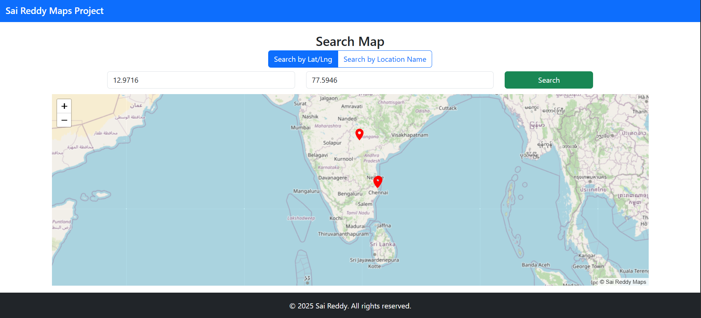

## 🗺️ Sai Reddy Maps Project

An interactive map application built using **Angular 18** and **Leaflet.js**, which allows users to:

- Get their **current location** on the map.
- **Search and plot** locations using:
  - Latitude and Longitude
  - Location name (via OpenStreetMap geocoding)
- Add multiple **custom markers** using Material Icons.
- Clean UI with Bootstrap layout, sticky header/footer, and responsive design.

---

### 🚀 Features

- 📍 Get current user location using browser Geolocation.
- 🔎 Toggle between **coordinate-based** and **name-based** search.
- 🗺️ Interactive map powered by [Leaflet.js](https://leafletjs.com).
- 🎨 Uses Angular Material icons for marker styling.
- 🧹 Removes default Leaflet branding for a cleaner UI.
- 💡 Responsive layout using Bootstrap 5.

---

### 🛠️ Why Leaflet + Angular?

- **Leaflet.js** is lightweight, open-source, and ideal for interactive maps.
- Angular 18 provides powerful standalone components and modern architecture.
- The combination allows us to manage state and interactivity cleanly within components.
- Leaflet gives more control over markers and overlays without heavy dependencies like Google Maps.

---

### 📦 Tech Stack

- Angular 18 (Standalone Components)
- Leaflet.js
- Bootstrap 5
- Angular Material Icons
- OpenStreetMap (for tiles and geocoding)

---

### 📷 Demo



---

### 📂 How to Run

```bash
# Clone the repo
git clone https://github.com/SaiReddyA/Google-Maps-by-SaiReddy.git
cd sai-reddy-maps

# Install dependencies
npm install

# Run the app
ng serve
```

---
